# DeltaBox — ATC 2026 Artifact Evaluation

[English](README.md) | **简体中文**

**申请徽章：Available、Functional、Reproduced。**

DeltaBox 对智能体沙箱的文件系统和进程状态做 checkpoint、restore 和分支，使树搜索智能体能以较低成本探索不同的候选路径。本 artifact 包含 DeltaBox 运行时、录制的智能体工作负载、实验驱动和绘图脚本，用于评估状态管理开销、内存占用和写放大。CPU 实验重放录制的 LLM 响应，因此不需要 LLM API key。

建议按以下三步评估：

1. 运行[快速检查](#quick-start)（约 5 分钟），确认环境可用。
2. 用 `ae/run_all_no_gpu.sh` 运行[全部 CPU 实验](#run-all)（约 2 小时）。
3. 按需从[实验索引](#experiments)中单独重跑某项实验。

为控制运行时间，每项实验默认最多使用 3 条输入，少于论文中的数量；可用 [`--limit N`](#run-all) 增加。Replay、CRIU 和 Firecracker Diff（FC-Diff）从固定的 44 条录制轨迹中选取输入。Figure 8(b) 需要另一台机器上的 GPU；没有空闲 GPU 时，报告中记为跳过。

[快速开始](#quick-start) · [实验索引](#experiments) · [查看结果](#results) · [运行问题](#troubleshooting) · [自建环境](#self-hosting) · [托管机器说明](#hosted-details)

## 1. 快速开始

<a id="quick-start"></a>
<a id="快速检查"></a>

### 登录并检查环境

请通过 AE 提交系统的评论区发送你的 SSH 公钥。收到访问说明后，登录并运行快速检查，将 `HOST` 替换为分配给你的地址：

```bash
ssh atc-ae@HOST
cd ~/delta-box-ae
bash ae/run_test.sh
```

AE 机器已提供 Linux x86-64 与 KVM、实验镜像、录制输入和 baseline 服务，无需自行构建。本文所有命令都在仓库根目录（`~/delta-box-ae`）下执行。如需在自己的机器上运行，见[自建环境指南](ae/docs/self-hosting-zh.md)。

快速检查会启动 DeltaBox，执行一段简短的 checkpoint / restore 序列，校验恢复后的状态，并分析数据、生成图表。退出码为 0 且终端打印下面这一行，即表示成功：

```text
ok: <结果目录>/SUMMARY.md
```

此时 `SUMMARY.md` 中每个步骤都应为 `ok`。快速检查只说明运行流程可用；论文结论由下面的实验检验。

快速检查的结果保存在 `ae/results/checks/quick-check-<时间戳>/`。AE 机器上的运行逐个执行。CPU 与内存绑定来自公共的 `measurement` 配置，对一次运行中的所有 CPU 实验生效。

如需把某次运行绑定到其他 NUMA 节点，将 `AE_NUMA_NODE` 和 `AE_CPUS` 设为该节点及其 CPU 列表，并同时传入：

```bash
bash ae/run_test.sh --numa-node "$AE_NUMA_NODE" --cpus "$AE_CPUS"
```

CPU 必须属于该节点。内存余量检查和 CPU 频率恢复仍然生效。

### 运行全部 CPU 实验

<a id="一键运行"></a>
<a id="run-all"></a>

在 AE 机器上以 `atc-ae` 登录，运行：

```bash
cd ~/delta-box-ae
bash ae/run_all_no_gpu.sh
```

无需任何参数，运行约需 2 小时。它会运行 Table 2、Table 3，Figure 2、6、7、8(a)、9 以及文件系统正确性测试所需的全部 16 项 CPU 实验。两组固定 CPU 分担这些实验：NUMA 节点 1 的 CPU 28–31 和 NUMA 节点 2 的 CPU 48–51。每组 CPU 从共享队列中领取下一项待运行的实验，并逐个执行其中的作业。会改动 CubeSandbox 或 E2B 服务的实验不会同时运行。GPU 实验（Figure 8(b) 和 8(c)）不在本次运行范围内。

默认每项实验最多使用 3 条输入。在重放录制运行的实验中，一条输入就是一条录制轨迹，总是完整执行到底；Figure 8(a) 和正确性测试不重放轨迹，而是使用固定的 fan-out 负载和测试负载。一条输入可以产生多个作业：Figure 6(b) 对每条输入运行两种策略，Figure 9 在三种文件系统上各运行一次。

脚本会创建新的结果目录并打印其路径；如需自行指定，使用 `--output`。退出码为 0，且该目录下的 `SUMMARY.md` 将全部 16 项实验标为 `ok`，即表示运行成功。CPU 绑定是固定的，不能修改。

脚本能够应对共享机器上偶发的波动，例如暂时的内存紧张或 baseline 服务响应变慢。某项实验失败时，脚本会先清理并确认清理完成，再继续同一次运行，最多 3 次。每次失败都会保留记录；经过续跑才成功的运行会标为续跑，而不是一次连续通过。遇到 Ctrl-C 等中断、无法确认的清理，或运行期间代码或配置发生变化时，脚本不会重试。如需自己继续一次已停止的运行，把它的目录传给 `--resume`；手动续跑不会再自动重试。全部选项见 `bash ae/run_all_no_gpu.sh --help`。

如需使用更多输入，传入 `--limit N`，N 最大为 10：

```bash
bash ae/run_all_no_gpu.sh --limit 5
```

这只改变输入数量；每条输入仍完整执行，并包含它的全部配置。每项实验另有 10 个作业的上限，因此有多种配置的实验实际使用的输入可能少于 N。例如 Figure 9 最多使用 3 条输入（9 个作业）。上限越大，运行时间越长。

作者可能在 NUMA 节点 0 和 3 上运行后台验证（见[托管机器说明](#hosted-details)）。此命令优先：后台运行会先停止并完成清理，因此你的运行最多可能推迟约 12 分钟开始。

### 可选：顺序运行 CPU 与 GPU 实验

`ae/run_all.sh` 在单一 NUMA 绑定上依次运行 CPU 实验，然后运行 GPU 实验：

```bash
bash ae/run_all.sh --limit 3
```

如需指定绑定：

```bash
bash ae/run_all.sh --limit 3 --numa-node "$AE_NUMA_NODE" --cpus "$AE_CPUS"
```

它使用与上面相同的 3 条输入上限和输入池，运行结束后分析结果并生成对比页。CPU 实验之后，它会检查 GPU 主机 `allinai2plus` 上预留的 GPU 0、3、6、7：没有空闲 GPU 时，Figure 8(b) 记为跳过；有 1–3 张空闲时，运行八个案例中的六个；有 4 张时运行全部八个。GPU 是否可用不影响 CPU 结果。所有 CPU 和 GPU 输入都完成后会自动计算 Figure 8(c)；也可以[手动计算](#figure-08-gpu)。

### 输入集合

Replay、CRIU 和 FC-Diff 从固定的 44 条轨迹中选取输入，其中 34 条 Django、10 条 Astropy。每个 backend 保持自己的输入顺序，而这个顺序中的前 10 条都是 Astropy，因此上限不超过 10 时，这三个 baseline 只会测到 Astropy 输入。如需改从原始的更大输入池选取（Replay 和 CRIU 各 244 条，FC-Diff 238 条），加上 `--baseline-inputs all`：

```bash
bash ae/run_all.sh --limit 3 --baseline-inputs all
```

这个选项决定从哪个池中选取输入，而不决定使用多少条；默认值为 `44`。可用 `--limit 1` 做更小规模的试运行。除非传入 `--max-events`，事件不会被截断。

每次运行都会在各个 plan 和 `suite.json` 中记录实际使用的输入。Table 2 按各 backend 自己的输入对事件求平均；每个报告数值所依据的输入集合，列在 AE 机器上的作者总账 `/mnt/disk2/dyp/deltabox-runtime/ae/report/README.md` 中。

### 结果保存位置

运行结束后，先打开 `result.md`（与 `SUMMARY.md` 内容相同）查看每项实验和 GPU 阶段的状态，再打开 **`comparison/attempt-NNN/README-zh.md`**（中文）或 **`README.md`**（英文），对照论文查看你的测量结果；两页同时生成，可以互相切换。具体路径记录在 `review.json` 的 `outputs.comparison` 中。失败的步骤会保留日志，并使命令以非零退出码结束。

每次新运行都写入 `ae/results/selected/` 下自己的目录，快速检查写入 `ae/results/checks/`。除非续跑，运行不会写入已存在的目录。继续运行的方法见[续跑与运行问题](#troubleshooting)。

## 2. 实验索引与单项运行

<a id="experiments"></a>
<a id="实验索引"></a>
<a id="4-论文图表--实验步骤"></a>
<a id="逐项实验"></a>
<a id="5-逐项实验"></a>

`ae/run_all_no_gpu.sh` 会运行下面所有 CPU 实验；Figure 8 的 GPU 部分需要用 `ae/run_all.sh`。只想检验某一项结论时，直接运行对应小节即可，无需先跑完整套实验。

| 论文项 | 评估问题 | 命令选项 | 资源 |
| --- | --- | --- | --- |
| [Table 2](#table-02) | 各系统 checkpoint / restore 的开销是多少？ | `--group table-02` | CPU、KVM、baseline 服务 |
| [Table 3](#table-03) | DeltaBox 的开销来自哪些组件？fast 与 slow 路径有何区别？ | `--group table-03` | CPU、KVM |
| [Figure 2](#figure-02) | 每步修改的状态相对于总状态有多大？ | `--group figure-02` | CPU |
| [Figure 6](#figure-06) | 内存策略和 lightweight-skip 如何影响内存与时延？ | `--group figure-06` | CPU、KVM |
| [Figure 7](#figure-07) | 状态管理相对 LLM 与动作时间增加多少开销？ | 由 Table 2 派生（DeltaBox 与 E2B） | CPU、KVM、E2B 服务 |
| [Figure 8(a)](#figure-08) | 创建更多分支时，fan-out 时间如何增长？ | `--group figure-08-cpu` | CPU、KVM、Cube/E2B 服务 |
| [Figure 8(b)(c)](#figure-08-gpu) | GPU 阶段耗时如何影响理论占用率？ | `--group figure-08`：CPU + GPU + 理论计算 | 单卡与四卡 GPU；CPU fan-out |
| [Figure 9](#figure-09) | reflink 如何影响编辑时的 copy-up 和设备写入量？ | `--group figure-09` | CPU、KVM |
| [§6.3.3](#correctness) | checkpoint / restore 是否保持文件系统语义？ | `--experiment correctness` | CPU、KVM |

Table 1 以及 Figure 1、3–5 介绍研究动机和设计，没有对应的实验。

下面的命令共用一个输出前缀。在当前终端中设置一次，把 `reviewer-A` 换成你自己的标识；每开始一轮新的评估，使用新的标识：

```bash
export AE_RUN="$(pwd -P)/ae/results/reviewer-A"
```

不要自己预先创建输出目录。启动器会使用提供的配置，并负责 CPU/NUMA 绑定和频率采样。请逐个运行命令；一次运行中的所有 CPU 实验都使用该运行的 NUMA 绑定。各实验驱动自行选择输入；可用 `--limit N` 增加或减少输入数，每项实验最多 10 个作业。

下面每一节给出验证目标、运行命令、输出以及解读方法。右侧图片是完整运行的输出示例，仅作说明；评估时请以你自己运行生成的对比页为准。

### 2.1 Table 2：checkpoint / restore 开销

<a id="table-02"></a>
<a id="对比table2"></a>
<a id="步骤1"></a>
<a id="基线实验"></a>

**验证目标。** 测量 DeltaBox、Replay、CRIU、FC-Diff、CubeSandbox 和 E2B 保存与恢复沙箱状态所需的时间，即在智能体分支之间切换的成本。

**运行。**

```bash
bash ae/run_all.sh --group table-02 --output "$AE_RUN/table-02"
```

如需只运行一个 backend，使用 `--experiment table-02-e2b` 等选项，并指定新的输出目录。

**输出与判断。** 打开 `table-02-comparison.png`。分别比较 checkpoint 和 restore：先在每个工作负载组内比较，再看 `All` 行（图中标为 `Event Avg`）。`All` 是对全部事件求平均，因此不等于四个组均值的简单平均。单位为毫秒，越低越好。论文的结论是 DeltaBox 的开销低于各 baseline。比较不同系统时，请注意各系统的配置以及计时所包含的范围。

<table>
<tr><th>论文图表</th><th>脚本输出示例</th></tr>
<tr>
<td align="center" valign="top"><a href="ae/reference/figures/table-02.png">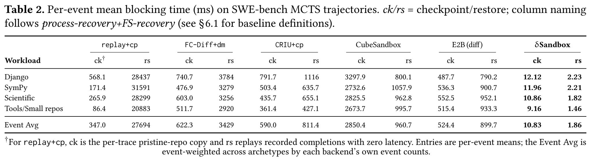</a></td>
<!-- AE-RESULT:table-02:start -->
<td align="center" valign="top"><a href="docs/images/table-02-ae.png">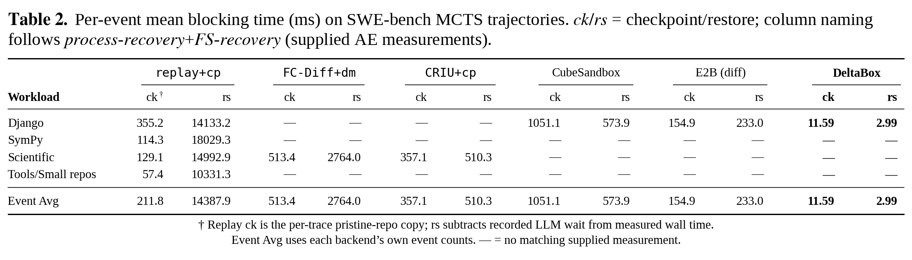</a><br><small><a href="docs/images/table-02-comparison.png">查看并排大图</a></small></td>
<!-- AE-RESULT:table-02:end -->
</tr>
</table>

### 2.2 Table 3：DeltaBox 组件时延

<a id="table-03"></a>
<a id="对比table3"></a>

**验证目标。** 将 DeltaBox 的 checkpoint 和 restore 时间拆分到各个组件，并比较两种恢复方式：fast restore 复用保留的模板，slow restore 通过 CRIU 重建进程。

**运行。**

```bash
bash ae/run_all.sh --group table-03 --output "$AE_RUN/table-03"
```

两种模式使用相同的输入。lazy pages 等运行时选项见[Table 3 实验说明](ae/docs/table3-method.md)。

**输出与判断。** 在 `table-03-comparison.png` 中查看 Overlay、fork/CRIU 和 coordination 三个组件，找出每条恢复路径的主要开销。fast restore 更快，是因为复用模板省去了大部分进程重建工作。各组件之和构成 Table 3 的总时间，但它们覆盖的时间窗口比 Table 2 的端到端 API 时间窄，因此两张表不能直接比较。`—` 表示该组件不适用于这条路径。

<table>
<tr><th>论文图表</th><th>脚本输出示例</th></tr>
<tr>
<td align="center" valign="top"><a href="ae/reference/figures/table-03.png">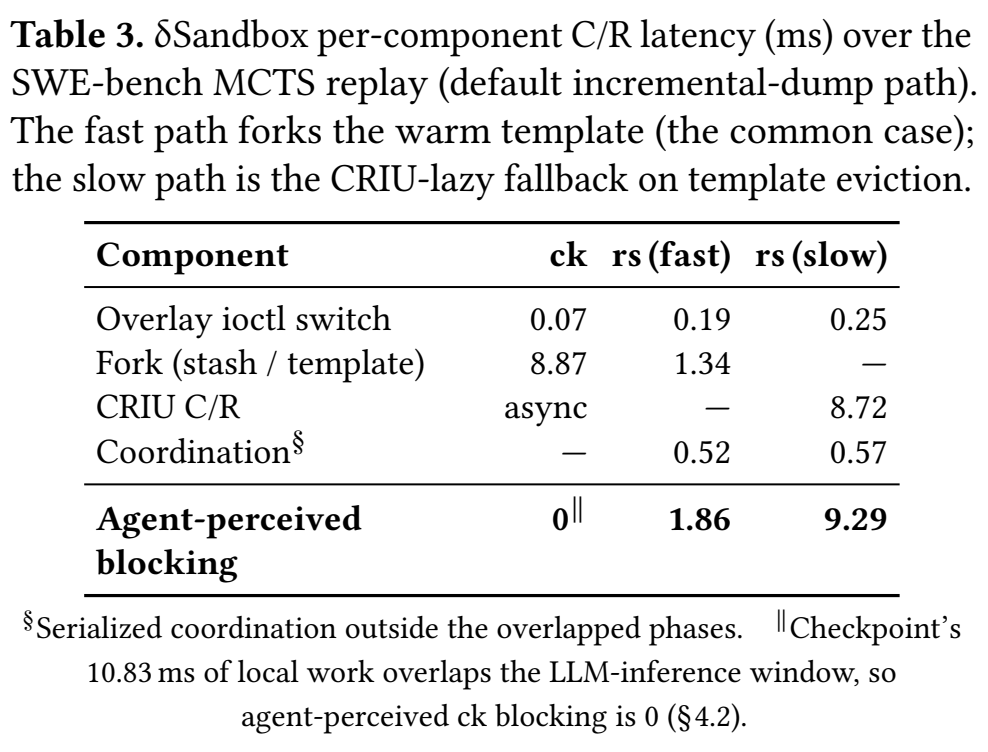</a></td>
<!-- AE-RESULT:table-03:start -->
<td align="center" valign="top"><a href="docs/images/table-03-ae.png">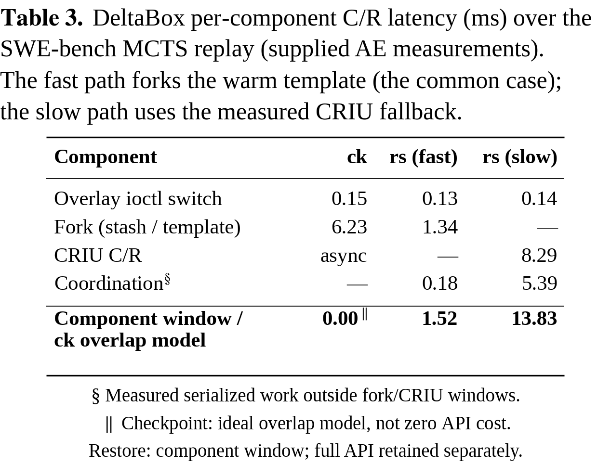</a><br><small><a href="docs/images/table-03-comparison.png">查看并排大图</a></small></td>
<!-- AE-RESULT:table-03:end -->
</tr>
</table>

### 2.3 Figure 2：每步状态变化量

<a id="figure-02"></a>
<a id="对比figure2"></a>
<a id="步骤3"></a>

**验证目标。** 检验智能体的一次动作是否通常只改变一小部分文件系统和内存状态，这是采用增量 checkpoint 的依据。

**运行。**

```bash
bash ae/run_all.sh --group figure-02 --output "$AE_RUN/figure-02"
```

**输出与判断。** 在 `figure-02-comparison.png` 中，面板 (a) 比较总状态大小与每步的变化量，面板 (b) 展示变化量在搜索过程中的走势。关注典型变化量相对总量有多小，以及偶尔出现的大幅更新。文件系统和内存使用不同的坐标轴和单位，只在各自的面板内比较。

<table>
<tr><th>论文图表</th><th>脚本输出示例</th></tr>
<tr>
<td align="center" valign="top"><a href="ae/reference/figures/figure-02.png">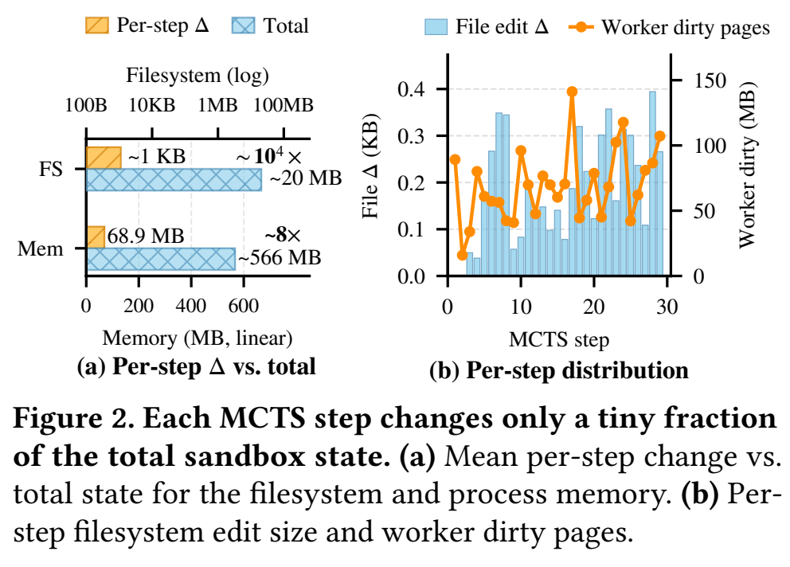</a></td>
<!-- AE-RESULT:figure-02:start -->
<td align="center" valign="top"><a href="docs/images/figure-02-ae.png">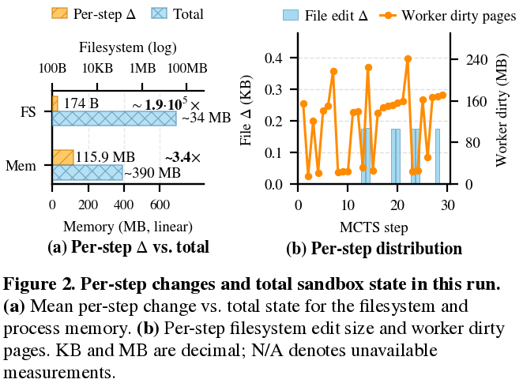</a><br><small><a href="docs/images/figure-02-comparison.png">查看并排大图</a></small></td>
<!-- AE-RESULT:figure-02:end -->
</tr>
</table>

### 2.4 Figure 6：内存策略与 lightweight-skip

<a id="figure-06"></a>
<a id="对比figure6"></a>
<a id="步骤4"></a>

**验证目标。** 测量搜索加深时内存如何增长，并检验 lightweight-skip（LW-skip）checkpoint 能否降低符合条件的步骤的成本。

**运行。**

```bash
bash ae/run_all.sh --group figure-06 --output "$AE_RUN/figure-06"
```

面板 (a) 在同一个 SymPy 工作负载上运行 `none`、`skip`、`gc` 和 `warm` 四种策略。面板 (b) 在相同输入上比较 standard-only 与 adaptive 两种策略。只运行其中一个面板时，使用 `--experiment figure-06-memory` 或 `--experiment figure-06-adaptive`。

**输出与判断。** 在 `figure-06-comparison.png` 的面板 (a) 中，比较各策略的增长速度和峰值，判断 LW-skip 是否限制了搜索期间保留的内存。在面板 (b) 中，比较 standard 与 lightweight checkpoint 的时延分布，包括低时延的 lightweight 事件，以及 adaptive 策略仍需进行的 standard checkpoint。横轴（时延）为对数刻度，纵轴为事件数。两个面板分别分析，不要合并它们的策略或样本。

<table>
<tr><th>论文图表</th><th>脚本输出示例</th></tr>
<tr>
<td align="center" valign="top"><a href="ae/reference/figures/figure-06.png">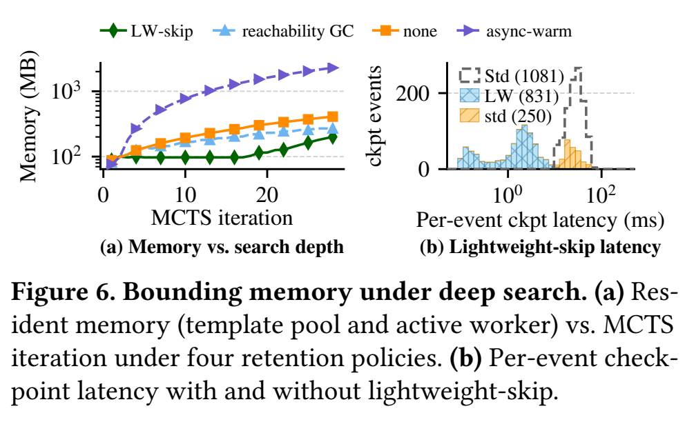</a></td>
<!-- AE-RESULT:figure-06:start -->
<td align="center" valign="top"><a href="docs/images/figure-06-ae.png">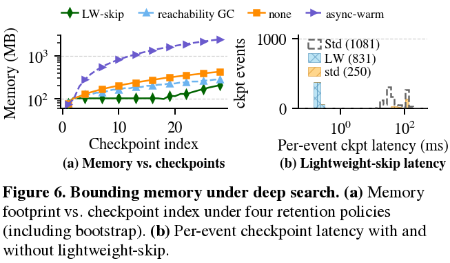</a><br><small><a href="docs/images/figure-06-comparison.png">查看并排大图</a></small></td>
<!-- AE-RESULT:figure-06:end -->
</tr>
</table>

### 2.5 Figure 7：相对 LLM 与动作时间的开销

<a id="figure-07"></a>
<a id="对比figure7"></a>
<a id="figure7映射"></a>

**验证目标。** 测量状态管理成本相对于智能体自身执行时间的大小，并检验 DeltaBox 能否在各工作负载上使归一化时间接近 1.0×。

**运行。**

```bash
bash ae/run_all.sh \
  --experiment table-02-deltabox --experiment table-02-e2b \
  --output "$AE_RUN/figure-07"
```

Figure 7 由这些完整轨迹计算得出，不需要单独的计时运行。如果已经运行过 Table 2 或整套实验，直接使用那次的输出即可。

**输出与判断。** 打开 `figure-07-comparison.png`。1.0× 线代表 LLM 与动作时间，高出的部分是状态管理开销。请分别比较 Django、SymPy、Scientific 和 Tools/Small 四组，而不是只凭绝对毫秒数判断影响。每根柱子是组内总量之比（各计时组件求和），而不是逐步比值的平均。

<table>
<tr><th>论文图表</th><th>脚本输出示例</th></tr>
<tr>
<td align="center" valign="top"><a href="ae/reference/figures/figure-07.png">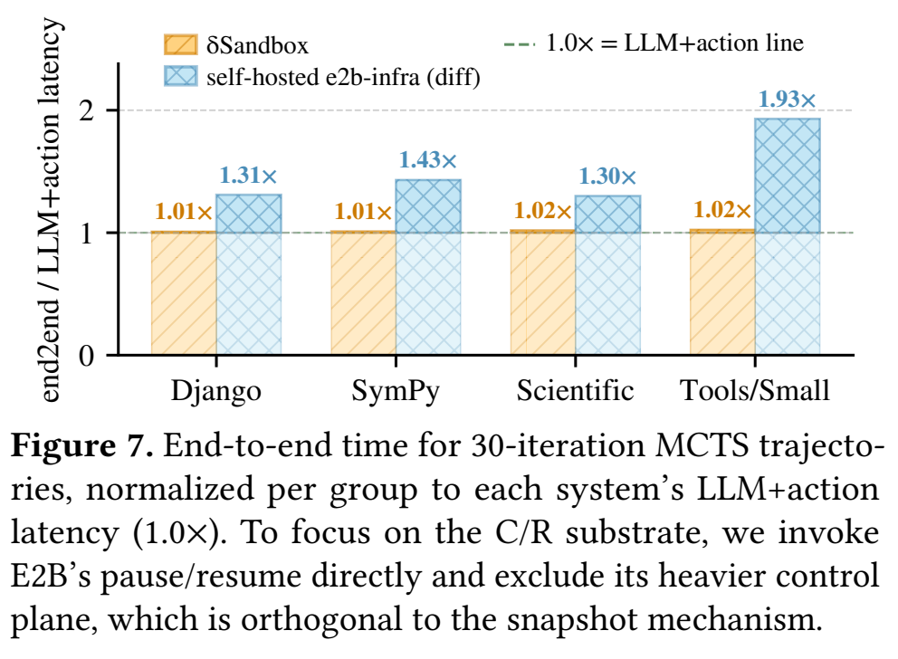</a></td>
<!-- AE-RESULT:figure-07:start -->
<td align="center" valign="top"><a href="docs/images/figure-07-ae.png">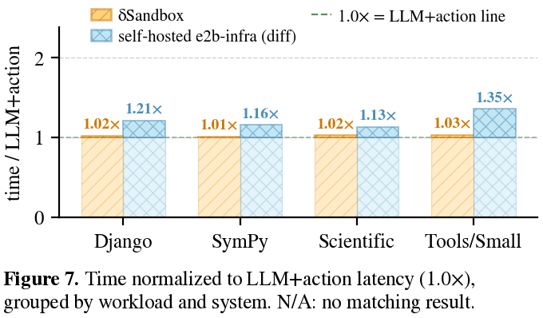</a><br><small><a href="docs/images/figure-07-comparison.png">查看并排大图</a></small></td>
<!-- AE-RESULT:figure-07:end -->
</tr>
</table>

### 2.6 Figure 8(a)：CPU fan-out

<a id="figure-08"></a>
<a id="对比figure8"></a>
<a id="步骤5"></a>

**验证目标。** 测量从同一冻结状态创建可用分支所需的时间，以及这一成本随分支数增长的趋势。

**运行。**

```bash
bash ae/run_all.sh --group figure-08-cpu --output "$AE_RUN/figure-08-cpu"
```

DeltaBox 和 E2B 创建 N = 1、4、16、64 个分支；CubeSandbox 创建 N = 1 和 16 个。每个子实例都会读回继承到的状态，但各系统的校验方式不同：DeltaBox 逐页比较读到的值与期望值，CubeSandbox 比较内存 checksum 与期望值，而 E2B 的校验器核对 token，对 checksum 和字节数字段只检查是否存在。

**输出与判断。** 在 `figure-08-cpu-comparison.png` 中，比较相同 N 下所有分支就绪所需的时间，以及各曲线随 N 增长的趋势。论文认为，低成本的分支创建使更宽的搜索成为可能。通过各自系统的校验，是分支成功的一部分。

<table>
<tr><th>论文图表</th><th>脚本输出示例</th></tr>
<tr>
<td align="center" valign="top"><a href="ae/reference/figures/figure-08.png">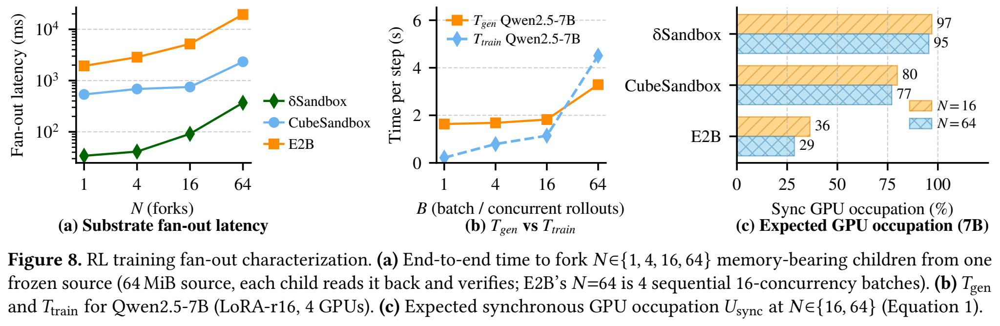</a></td>
<!-- AE-RESULT:figure-08:start -->
<td align="center" valign="top"><a href="docs/images/figure-08-cpu-ae.png">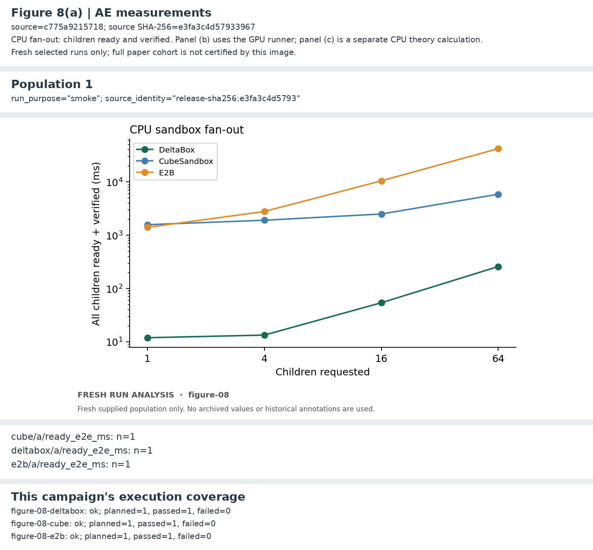</a><br><small><a href="docs/images/figure-08-cpu-comparison.png">查看并排大图</a></small></td>
<!-- AE-RESULT:figure-08:end -->
</tr>
</table>

### 2.7 Figure 8(b)(c)：GPU 时延与理论占用率

<a id="figure-08-gpu"></a>
<a id="figure-8b-gpu"></a>
<a id="获得-gpu-后的命令"></a>

**验证目标。** 在 GPU 上测量 LLM 生成和训练时间，并结合沙箱时间，计算论文中建模的 GPU 占用率和 policy staleness。

`ae/run_all.sh` 和 `--group figure-08` 会使用[远端配置](ae/configs/figure08-remote.json)通过 SSH 自动运行面板 (b)。[Figure 8 说明](ae/paper/figure-08/README.md)介绍了环境准备、GPU 的选择方式，以及只有部分案例能运行时的处理方式。快速检查和只分析已有数据的运行不会启动 GPU 任务。只运行 GPU 阶段：

```bash
bash ae/run_all_gpu.sh
```

命令结束时会直接打印 GPU 专用汇总，列出 8 项测试各自的状态、用卡数、重复次数和平均耗时，并给出准确的 `SUMMARY.md` 路径。同一份汇总也保存为 `result.md`，无需自己查找结果目录。

GPU 专用入口默认使用 `allinai2plus` 的物理 GPU **0、3、6、7**，并自动创建新的结果目录。完整 8 项测试需要 4 张空闲 GPU：生成阶段和 batch 1/4 的训练使用 1 张，batch 16/64 的训练使用 4 张。可用 `--output PATH` 指定结果目录。`--gpu-devices ID,...` 用于选择其他 GPU，只有作者为你分配了其他 GPU 时才需要使用。脚本排除繁忙设备，不会选择指定范围以外的卡；资源不足时明确报告部分完成或不可用。此入口只运行面板 (b)，面板 (c) 还需要 CPU fan-out 结果。如需用这次 GPU 运行和之前 `ae/run_all_no_gpu.sh` 的结果计算面板 (c)，把下面两个目录换成这两次运行打印的目录：

```bash
"$AE_PYTHON" ae/repro/gpu_occupation.py \
  --gpu-results <gpu-run>/gpu/attempt-001/results/summary.json \
  --fanout-summary <cpu-run>/analysis/attempt-001/summary.json \
  --output ae/results/selected/figure-08c --plot
```

图保存在 `ae/results/selected/figure-08c/plots/figure-08c.png`。CubeSandbox 只测 N = 1 和 16，因此 N = 64 一格标为未测量。

重跑 Figure 8 的全部面板：

```bash
bash ae/run_all.sh --group figure-08 --output "$AE_RUN/figure-08"
```

远端的模型和 Python 环境由作者维护。脚本只检查预留的 GPU 0、3、6、7（远端配置中的 `devices` 列表），并把繁忙或不可用的 GPU 记为跳过，不会使用其他 GPU。空闲 GPU 不足时，运行会产生一个标为部分结果的输出；每个案例的参数保持不变。见[GPU 环境指南](ae/docs/self-hosting-zh.md#gpu-setup)。

**输出与判断。** 面板 (b) 输出每次重复的生成与训练时间，以及 `gpu/attempt-NNN/plots/figure-08b.png`；请在相同 batch size 下比较同一阶段。CPU fan-out 和 GPU 测量都成功后，面板 (c) 输出 `gpu/attempt-NNN/comparison/theory/occupation.json` 及相应图表。面板 (c) 是模型计算，而不是测量：检查沙箱时间缩短后，模型中的有效 GPU 占用率是否提高、staleness 是否降低。两个面板都会出现在本次运行的中英文对比页中。

<table>
<tr><th>论文图表</th><th>脚本输出示例</th></tr>
<tr>
<td align="center" valign="top"><a href="ae/reference/figures/figure-08.png"></a></td>
<!-- AE-RESULT:figure-08-gpu:start -->
<td align="center" valign="top"><a href="docs/images/figure-08b.png">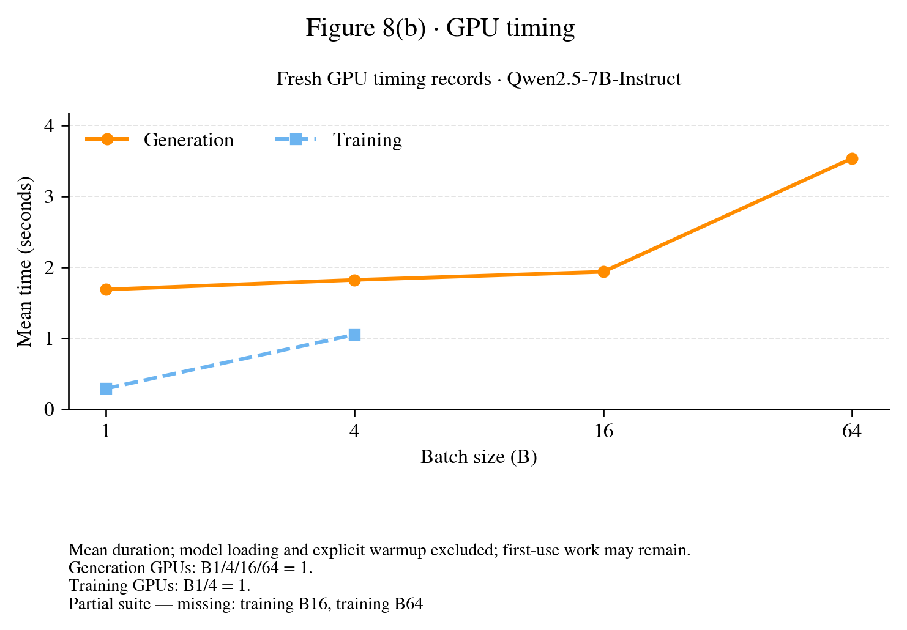</a><br><small><a href="docs/images/figure-08b-comparison.png">查看并排大图</a></small></td>
<!-- AE-RESULT:figure-08-gpu:end -->
</tr>
</table>

### 2.8 Figure 9：写放大

<a id="figure-09"></a>
<a id="对比figure9"></a>
<a id="步骤6"></a>

**验证目标。** 测量在 ext4、XFS 和启用 reflink 的 XFS 上编辑文件时的 copy-up 数据量和设备写入量，检验共享数据块能否减少写放大。

本 artifact 运行固定的 [80 条轨迹](ae/paper/figure-09/cohort-80.json)，它们选自原始的 [185 条轨迹集合](ae/paper/figure-09/cohort-war.csv)，涵盖四种模型/搜索组合、十个项目以及较长的编辑序列，并非随机抽样。每条轨迹在三种文件系统上各运行一次，共 240 个作业；默认上限下运行其中 3 条轨迹（9 个作业）。185 条的集合仅作为证据保留，无法重新运行。`--baseline-inputs all` 只影响 Table 2 的三个 baseline，不影响 Figure 9。

**运行。**

```bash
bash ae/run_all.sh --group figure-09 --output "$AE_RUN/figure-09"
```

内存盘版本有独立的入口和配置，见[自建与定向运行指南](ae/docs/self-hosting-zh.md#specialized-runs)。

如需在新目录中继续一次中断的 Figure 9 运行，可复用已核验的作业，只运行缺少的部分：

```bash
bash ae/run_all.sh --group figure-09 \
  --reuse-completed-from "$AE_RUN/figure-09-old" \
  --output "$AE_RUN/figure-09-continued"
```

复用某个作业前，脚本会核验它的输入、文件系统、资源配置、测量代码和产物哈希。复用的作业保留其原始代码版本记录，报告会区分哪些作业是复用的、哪些是新测量的。旧目录和新目录必须分开。此选项仅适用于 Figure 9，不能与 `--resume`、快速检查、`--limit` 或 `--max-events` 同时使用。

**输出与判断。** 在 `figure-09-comparison.png` 的两个面板中，于每个文件大小区间内比较三条曲线：reflink 是否减少了私有的 copy-up 数据？这部分减少又有多少体现在设备写入上？文件系统日志和元数据也会产生写入，因此两者不必相等。纵轴为每次编辑的字节数；设备写入量取自 loop 设备的写入计数。

<table>
<tr><th>论文图表</th><th>脚本输出示例</th></tr>
<tr>
<td align="center" valign="top"><a href="ae/reference/figures/figure-09.png">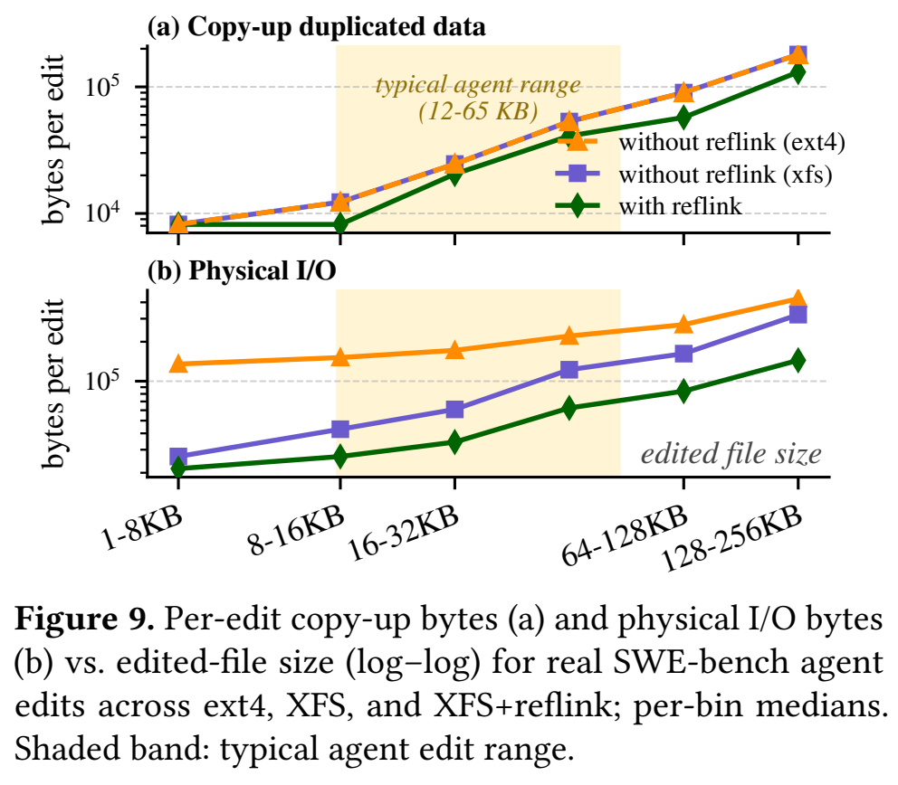</a></td>
<!-- AE-RESULT:figure-09:start -->
<td align="center" valign="top"><a href="docs/images/figure-09-ae.png">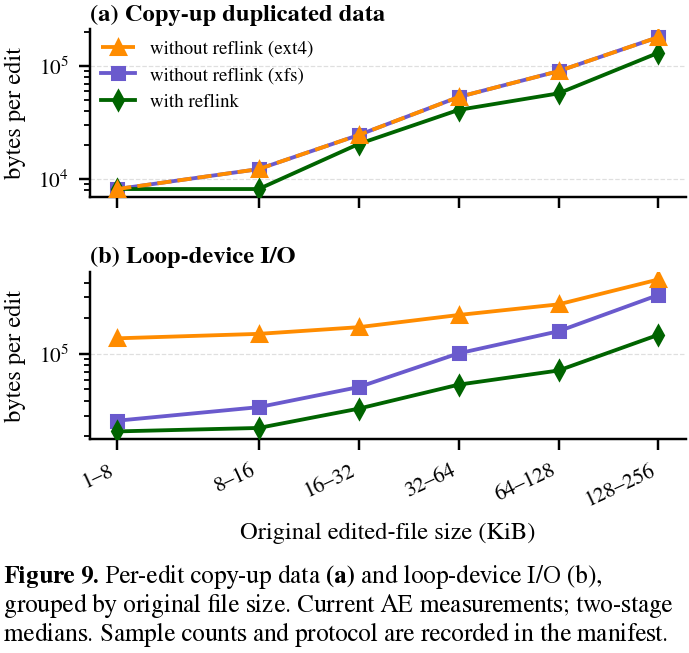</a><br><small><a href="docs/images/figure-09-comparison.png">查看并排大图</a></small></td>
<!-- AE-RESULT:figure-09:end -->
</tr>
</table>

### 2.9 文件系统正确性（§6.3.3）

<a id="correctness"></a>
<a id="步骤7"></a>

**验证目标。** 检查 checkpoint / restore 前后文件内容是否一致、指向已删除文件的打开文件描述符行为是否正确，以及写入在不同 checkpoint 之间是否隔离。

```bash
bash ae/run_all.sh --experiment correctness --output "$AE_RUN/correctness"
```

此命令运行 `test_full.sh`、`test_deleted_open_resurrect.sh` 和 `test_cross_checkpoint_fd_cow.sh`，其断言日志链接在 `SUMMARY.md` 中。每个脚本都应以 0 退出，并通过所有关于文件内容和文件描述符行为的具名断言。

## 3. 查看、核验和重绘结果

<a id="results"></a>
<a id="实验结果"></a>

单项实验和完整运行的输出目录结构相同。下列路径相对于终端打印的结果目录；当前的 `attempt-NNN` 由 `review.json` 指明。

| 路径 | 用途 |
| --- | --- |
| `result.md`、`SUMMARY.md`、`review.json` | 确认运行状态，定位输出与失败步骤 |
| `comparison/attempt-NNN/README-zh.md`、`README.md` | 中文、英文对比页：论文原图与本次测量并排对照 |
| `analysis/attempt-NNN/metrics.csv`、`series.csv` | 汇总数值与绘图数据 |
| `gpu/attempt-NNN/` | GPU 测量、资源检查、图表及 Figure 8(c) 理论计算 |
| `runs/`、`logs/attempt-NNN/` | 逐事件测量数据和执行日志 |
| `environment/attempt-NNN/` | 测量配置、CPU 频率及恢复记录 |

先确认实验成功，再按上面各节的说明检验论文结论。小规模运行（例如 `--limit 1`）只能说明流程可用。`N/A` 和 `—` 表示"未测量"，而不是零。

<a id="绘图"></a>
<a id="发布图片"></a>
<a id="6-分析结果与绘图"></a>

如需在不重新测量的情况下从已有原始结果重新生成图表，按[分析指南](ae/docs/self-hosting-zh.md#reanalyze)操作。

## 4. 续跑与运行问题

<a id="troubleshooting"></a>
<a id="运行提示"></a>
<a id="6-运行提示"></a>
<a id="7-运行提示"></a>
<a id="当前边界"></a>

续跑时保持相同的代码、配置和实验选择，把 `--output` 换成 `--resume`。例如续跑 Figure 6：

```bash
bash ae/run_all.sh --group figure-06 --resume "$AE_RUN/figure-06"
```

| 情况 | 处理方式 |
| --- | --- |
| 输出目录已存在 | 续跑该次运行，或为新运行选择新目录 |
| 提示另一个 AE 运行正在进行 | 等待该运行结束后重试 |
| 运行期间 SSH 连接断开 | 运行会停止；用 `--resume <结果目录>` 继续 |
| 长时间没有新的终端输出 | 查看 `SUMMARY.md` 链接的日志，或 `logs/attempt-NNN/<step>/stdout.log` |
| GPU 不可用或全部繁忙 | 请作者为 AE 机器分配 GPU，然后对同一输出目录续跑 |
| 依赖、权限或模板检查失败 | 保存 `SUMMARY.md` 和相关日志，通过 AE 提交系统联系作者 |
| 想做更小规模的运行 | 给单项命令加上 `--limit 1`，并使用单独的输出目录 |
| 想查看实验名称列表 | 运行 `bash ae/run_all.sh --list` |

测量期间请保持提供的资源配置。在这台共享机器上，不要在相同的 CPU 或 NUMA 节点上同时运行其他性能测试。账号说明见[托管访问指南](ae/docs/hosted-access.md)。

## 5. 自建环境与进一步阅读

<a id="self-hosting"></a>
<a id="环境准备"></a>
<a id="3-详细命令行指南"></a>
<a id="a2-构建镜像"></a>
<a id="baseline-配置"></a>
<a id="guest-内核"></a>
<a id="测量环境"></a>
<a id="路径-b母盘不可获取时的实验性重建"></a>

在自己的机器上运行，需要 Linux x86-64 与 KVM、DeltaBox guest 内核和磁盘镜像、工作负载环境，以及要对比的 baseline 服务。[自建环境指南](ae/docs/self-hosting-zh.md)介绍了资源要求、构建命令、配置和预检步骤。GPU 环境独立于 CPU/KVM 环境。`ae/run_all_no_gpu.sh` 使用的 CPU 与 NUMA 编号是这台 AE 机器专用的；在其他机器上请使用 `ae/run_all.sh`。

- [实验输入与文件清单](ae/paper/README.md)
- [镜像构建与模板准备](ae/images/README.md)

## 附录：托管机器说明

<a id="hosted-details"></a>

以下内容说明 AE 机器如何隔离和恢复每次运行，评估 artifact 时不需要阅读。

**受管执行。** 在 AE 机器上，`ae/run_all_no_gpu.sh` 在专属的 systemd unit 中运行，由 AE 脚本启动的进程不能使用 swap。运行被中断时，主进程收到 SIGINT 并执行正常清理；宽限期结束后，unit 会结束剩余的进程。启动器记录 unit 名称和最终的清理状态。

**CubeSandbox 内存。** CubeSandbox 从内存运行时，会临时为 Cube 服务关闭透明大页。AE 机器上的 Cube VMM 还包含一个 [pagemap 分类修复](ae/patches/cube-pagemap-stable-classification.md)：没有它时，主机迁移内存页后，VMM 可能通过过期的物理页号查询，错误判断该页是否为匿名页，从而漏存匿名页。源实例和子实例的内存校验和都会被核验，实验结束后恢复原有的服务设置。

**Figure 8 的 CubeSandbox 配置。** Figure 8 中 CubeSandbox 测试 N = 1 和 N = 16。脚本在本次运行的 NUMA 节点内，把 Cube 数据和 MySQL 元数据复制到私有、不使用 swap 的内存盘，保留数据库的持久化设置，并校验每个复制的文件。每个子实例继承的字节数、校验和与 token 都会被检查，结束后恢复服务和存储。如果某项资源无法释放或恢复，私有环境会连同 `RECOVERY_REQUIRED.json` 一起保留，供检查。准备和清理不计入克隆和校验的计时。每条 guest 命令执行前，驱动会通过一次只读请求确认 guest 代理（envd）已就绪；这段等待属于源准备或子实例校验阶段，与命令共用超时预算，且不会导致已提交的命令被重复发送。

**NUMA 节点 0 和 3 上的后台验证。** 作者使用第二个入口在后台验证 artifact，每次运行使用新的输出目录：

```bash
bash ae/run_all_no_gpu_numa03.sh --output "$PWD/ae/results/selected/numa03-validation"
```

它以相同的选项、驱动和报告运行同样的 16 项实验，但使用 NUMA 节点 0 的 CPU 0–3 和 NUMA 节点 3 的 CPU 72–75。由于两个入口使用同一套 CubeSandbox 和 E2B 服务，两次运行不会同时执行。审稿人的运行优先：后台运行先清理自己的实验并恢复服务，之后在同一目录中续跑，复用已核验的结果。已停止的后台运行也可以用 `--resume` 和原目录手动续跑，续跑时不能更换 CPU 布局。结果写入 `ae/results/selected/<运行目录>/`，脚本会打印准确路径。退出码为 0 且 `SUMMARY.md` 将全部 16 项实验标为 `ok`，即表示运行成功。

**单项 VM 实验的隔离验证。** 其他 NUMA 节点忙碌时，如需重跑一项小规模 VM 实验，使用独立的输出目录并显式指定绑定：

```bash
bash ae/run_all.sh --experiment figure-06-adaptive --limit 1 \
  --isolated-validation --numa-node "$AE_NUMA_NODE" --cpus "$AE_CPUS" \
  --output "$PWD/ae/results/selected/figure06-pilot"
```

此模式只支持部分 VM 实验，使用共享 CubeSandbox 或 E2B 服务的实验不在其列。它仍会独占所选的 NUMA 节点，且不会在结果备份期间运行。如需扩大规模，用相同的绑定和更大的 `--limit` 续跑同一目录；已完成的作业会经过核验后复用，已完成和失败的原始记录仍可分别识别。每条命令在读取续跑状态前都会锁定输出目录，因此两条命令不会同时写入同一目录，或同时写入一个目录及其子目录。`ae/results/checks/` 保留给快速检查。

**结果目录。** 小规模运行不使用旧的全量结果备份与轮换路径。备份空间不足或仍有其他任务在运行时，启动会停止，已有结果保持不变。每次运行都会记录所用的确切源码，无需源码锁。
