# DeltaBox — ATC 2026 Artifact Evaluation

**English** | [简体中文](README-zh.md)

**Badges sought: Available, Functional, Reproduced.**

DeltaBox provides checkpoint, restore, and branching of filesystem and process state for agent tree search. This artifact includes the runtime, recorded workloads, experiment drivers, and plotting tools for evaluating state-management overhead, memory use, and write amplification. CPU experiments replay recorded LLM responses; no LLM API key is required.

Start with the **approximately 5-minute quick check**, then allow **approximately 10 hours** for the complete CPU evaluation. Alternatively, select an experiment from the [index](#experiments). Figure 8(b) automatically probes the configured remote GPU host; unavailable resources are reported as skipped.

[Quick start](#quick-start) · [Experiment index](#experiments) · [Inspect results](#results) · [Self-hosting](#self-hosting) · [Troubleshooting](#troubleshooting)

## 1. Quick start

<a id="quick-start"></a>
<a id="快速检查"></a>
<a id="quick-check"></a>

### Log in and check the environment

Provide your SSH public key in the artifact submission system's comments. After receiving access instructions, replace `HOST` with the assigned address:

```bash
ssh atc-ae@HOST
cd ~/delta-box-ae
bash ae/run_test.sh
```

The hosted machine provides Linux x86-64, KVM, experiment images, recorded inputs, and baseline services. Run all commands below from the **delta-box-ae repository root** on that machine; image building is not a prerequisite. For your own machine, follow the [self-hosting guide](ae/docs/self-hosting.md).

The quick check starts DeltaBox, executes a minimal checkpoint/restore sequence, validates the restored state, analyzes the data, and generates figures. **Success** means exit code 0 and this terminal message:

```text
ok: <result-directory>/SUMMARY.md
```

Open that `SUMMARY.md`; each step should be `ok`. The quick check verifies the execution pipeline. The full experiments below evaluate the paper's claims.

### Run the complete evaluation

<a id="一键运行"></a>
<a id="run-all"></a>

```bash
bash ae/run_all.sh
```

This command runs all CPU experiments in the [index](#experiments), then analyzes the results, plots them, and creates paper-comparison pages. Budget approximately 10 hours; actual duration depends on host load and baseline execution time. Figure 7 is derived from complete trajectories. Figure 8(b) then automatically probes GPUs 0–7 on `allinai2plus`: no idle GPUs means a recorded skip, 1–3 allow six cases, and four allow all eight. GPU availability or failure does not invalidate CPU results. Figure 8(c) is derived when all fresh CPU/GPU inputs are complete; [manual calculation](#figure-08-gpu) is also available.

When the command finishes, open `result.md` (also written as `SUMMARY.md`) for CPU and GPU status, then **`comparison/attempt-NNN/README.md` (English)** or **`README-zh.md` (Chinese)** in that comparison folder. The one-click script generates both pages together, with language links at the top. The exact path is recorded in `review.json` under `outputs.comparison`. A successful complete run reports `ok`; failed steps retain their logs and cause a nonzero exit code.

Existing outputs are never overwritten. See [troubleshooting](#troubleshooting) for resuming a run or selecting an individual check.

## 2. Experiment index and individual runs

<a id="experiments"></a>
<a id="实验索引"></a>
<a id="4-论文图表--实验步骤"></a>
<a id="逐项实验"></a>
<a id="5-逐项实验"></a>
<a id="experiment-index"></a>
<a id="individual-experiments"></a>

The complete evaluation command includes the CPU and GPU entries below. To evaluate one claim, run its section directly; you do not need to run the entire suite first.

| Paper experiment | Evaluation question | Selection | Resources |
| --- | --- | --- | --- |
| [Table 2](#table-02) | What is each system's checkpoint/restore overhead? | `--group table-02` | CPU, KVM, baseline services |
| [Table 3](#table-03) | Which components contribute to DeltaBox overhead, and how do fast and slow restore differ? | `--group table-03` | CPU, KVM |
| [Figure 2](#figure-02) | How much state changes per step relative to total state? | `--group figure-02` | CPU |
| [Figure 6](#figure-06) | How do memory policies and lightweight-skip affect memory and latency? | `--group figure-06` | CPU, KVM |
| [Figure 7](#figure-07) | How much overhead does state management add relative to LLM and action time? | Complete DeltaBox + E2B trajectories | CPU, KVM, E2B services |
| [Figure 8(a)](#figure-08) | How does fan-out time grow with the number of branches? | `--group figure-08-cpu` | CPU, KVM, Cube/E2B services |
| [Figure 8(b)(c)](#figure-08-gpu) | How do GPU stage times affect modeled occupation? | `--group figure-08`: CPU + GPU + calculations | One and four GPUs; CPU fan-out |
| [Figure 9](#figure-09) | How does reflink affect copy-up and device writes during editing? | `--group figure-09` | CPU, KVM |
| [§6.3.3](#correctness) | Does checkpoint/restore preserve filesystem semantics? | `--experiment correctness` | CPU, KVM |

Table 1 and Figures 1, 3–5 present the design and problem motivation, with no separate measurement tasks.

Individual commands below share an output prefix. **Define it once in your current Bash terminal**, replacing `reviewer-A` with your identifier. Use a different identifier for each new evaluation:

```bash
AE_VERSION=$(git rev-parse --short=12 HEAD)
export AE_RUN="$(pwd -P)/ae/results/$AE_VERSION/reviewer-A"
```

Do not pre-create the individual output directories. The hosted launcher uses the supplied configuration and manages CPU/NUMA binding and frequency sampling. Run experiments sequentially to avoid resource contention. The drivers select their inputs; use `--limit` only for a smaller check.

Each section keeps the evaluation goal, command, output, and interpretation together. The side-by-side images are **examples of the one-click script's output**, illustrating the generated figures. Use the comparison pages from your own run for evaluation.

### 2.1 Table 2: checkpoint/restore overhead

<a id="table-02"></a>
<a id="对比table2"></a>
<a id="步骤1"></a>
<a id="基线实验"></a>
<a id="table-2-comparison"></a>
<a id="step-1"></a>
<a id="baseline-experiments"></a>

**Goal.** Compare the cost of saving and restoring state in DeltaBox, Replay, CRIU, FC-Diff, CubeSandbox, and E2B, and evaluate whether DeltaBox reduces the cost of switching agent branches.

**Run.**

```bash
bash ae/run_all.sh --group table-02 --output "$AE_RUN/table-02"
```

To select one backend, use an option such as `--experiment table-02-e2b` and choose a new output directory for it.

**Output and interpretation.** Open `table-02-comparison.png`. Compare checkpoint and restore separately, first within workload groups and then in the event-weighted `All` aggregate (labeled `Event Avg` in the figure). Values are milliseconds; lower is better. The paper's claim concerns DeltaBox's overhead advantage over the baselines. Check the configuration and timing definitions when comparing systems. `All` is not the unweighted mean of the four group averages.

<table>
<tr><th>Paper figure/table</th><th>Example script output</th></tr>
<tr>
<td align="center" valign="top"><a href="ae/reference/figures/table-02.png">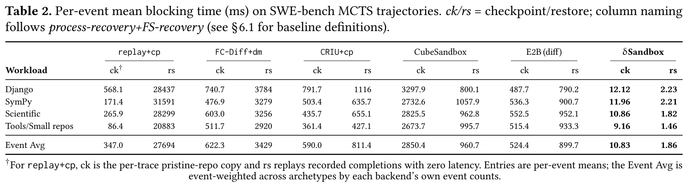</a></td>
<!-- AE-RESULT:table-02:start -->
<td align="center" valign="top"><a href="docs/images/table-02-ae.png">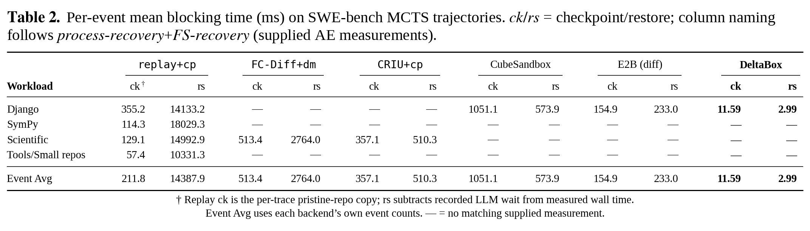</a><br><small><a href="docs/images/table-02-comparison.png">Open full comparison</a></small></td>
<!-- AE-RESULT:table-02:end -->
</tr>
</table>

### 2.2 Table 3: DeltaBox component latency

<a id="table-03"></a>
<a id="对比table3"></a>
<a id="table-3-comparison"></a>

**Goal.** Break down checkpoint and restore costs, comparing fast restore from a retained template with slow restore that reconstructs processes through CRIU.

**Run.**

```bash
bash ae/run_all.sh --group table-03 --output "$AE_RUN/table-03"
```

The same input set runs under fast and slow modes. See the [Table 3 guide](ae/docs/table3-method.md) for selecting runtime configurations such as lazy-pages.

**Output and interpretation.** Inspect Overlay, fork/CRIU, and coordination in `table-03-comparison.png` to identify the dominant costs and compare restore paths. Fast restore reuses templates to reduce process-reconstruction work. Component timings explain the total; distinguish component windows from complete API time when comparing with Table 2. `—` denotes a component that does not apply to that path.

<table>
<tr><th>Paper figure/table</th><th>Example script output</th></tr>
<tr>
<td align="center" valign="top"><a href="ae/reference/figures/table-03.png">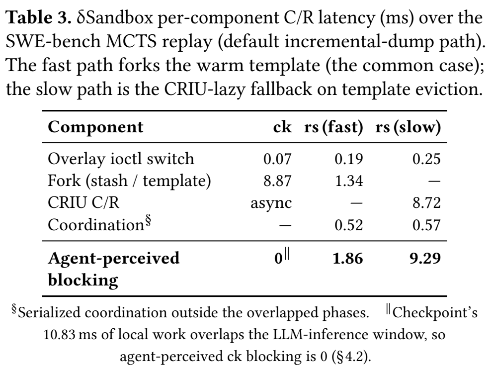</a></td>
<!-- AE-RESULT:table-03:start -->
<td align="center" valign="top"><a href="docs/images/table-03-ae.png">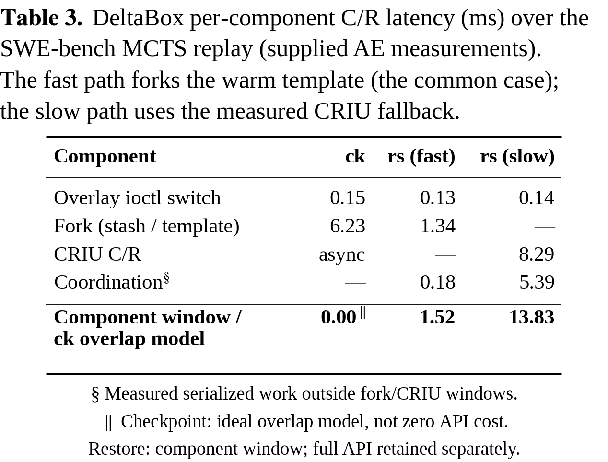</a><br><small><a href="docs/images/table-03-comparison.png">Open full comparison</a></small></td>
<!-- AE-RESULT:table-03:end -->
</tr>
</table>

### 2.3 Figure 2: state changes per step

<a id="figure-02"></a>
<a id="对比figure2"></a>
<a id="步骤3"></a>
<a id="figure-2-comparison"></a>
<a id="step-3"></a>

**Goal.** Test whether agent actions usually modify a small fraction of filesystem and memory state, motivating incremental checkpoints.

**Run.**

```bash
bash ae/run_all.sh --group figure-02 --output "$AE_RUN/figure-02"
```

**Output and interpretation.** In `figure-02-comparison.png`, panel (a) compares total state with per-step changes, while panel (b) shows changes over search steps. Examine the relative size of the changes and occasional large updates. Filesystem and memory use different axes and units; compare each within its own panel.

<table>
<tr><th>Paper figure/table</th><th>Example script output</th></tr>
<tr>
<td align="center" valign="top"><a href="ae/reference/figures/figure-02.png">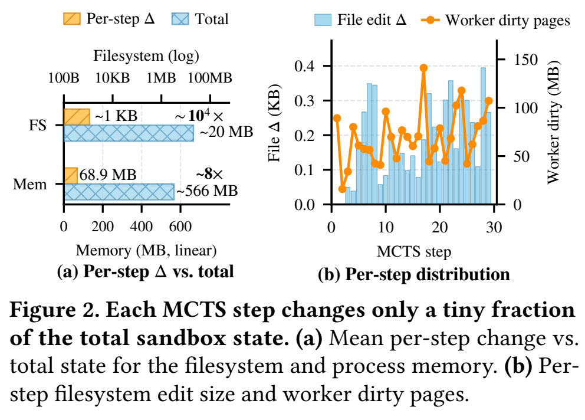</a></td>
<!-- AE-RESULT:figure-02:start -->
<td align="center" valign="top"><a href="docs/images/figure-02-ae.png">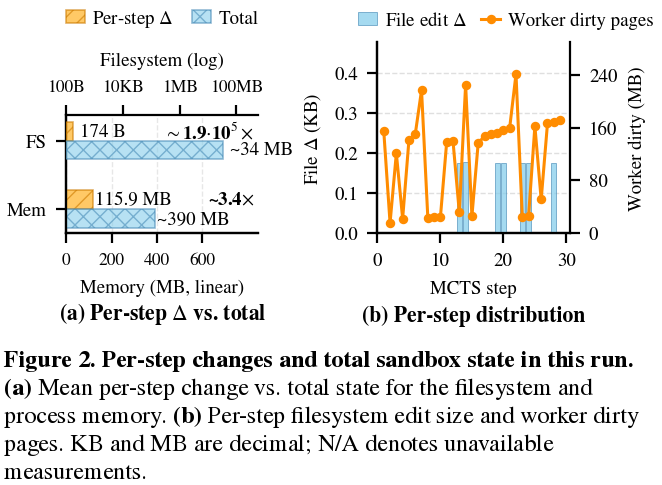</a><br><small><a href="docs/images/figure-02-comparison.png">Open full comparison</a></small></td>
<!-- AE-RESULT:figure-02:end -->
</tr>
</table>

### 2.4 Figure 6: memory policies and lightweight-skip

<a id="figure-06"></a>
<a id="对比figure6"></a>
<a id="步骤4"></a>
<a id="figure-6-comparison"></a>
<a id="step-4"></a>

**Goal.** Examine memory growth as search deepens, and test whether lightweight checkpoints reduce the cost of steps eligible for skipping.

**Run.**

```bash
bash ae/run_all.sh --group figure-06 --output "$AE_RUN/figure-06"
```

Panel (a) runs `none / skip / gc / warm` on the same SymPy workload. Panel (b) compares standard-only and adaptive policies on the same input set. Select `figure-06-memory` or `figure-06-adaptive` to run one panel separately.

**Output and interpretation.** In panel (a) of `figure-06-comparison.png`, compare growth rates and peaks to assess whether LW-skip limits memory retained during search. In panel (b), compare standard and lightweight checkpoint distributions, including the low-latency events and the standard checkpoints still required by the adaptive policy. Latency is on a logarithmic horizontal axis; the vertical axis counts events. The two panels are analyzed separately; do not pool their policies or samples.

<table>
<tr><th>Paper figure/table</th><th>Example script output</th></tr>
<tr>
<td align="center" valign="top"><a href="ae/reference/figures/figure-06.png">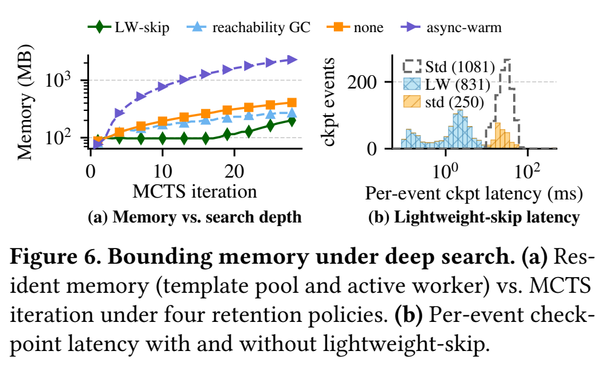</a></td>
<!-- AE-RESULT:figure-06:start -->
<td align="center" valign="top"><a href="docs/images/figure-06-ae.png">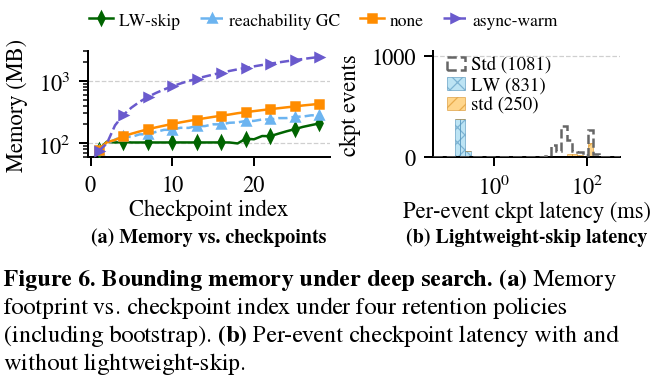</a><br><small><a href="docs/images/figure-06-comparison.png">Open full comparison</a></small></td>
<!-- AE-RESULT:figure-06:end -->
</tr>
</table>

### 2.5 Figure 7: overhead relative to LLM and action time

<a id="figure-07"></a>
<a id="对比figure7"></a>
<a id="figure7映射"></a>
<a id="figure-7-comparison"></a>
<a id="figure-7-mapping"></a>

**Goal.** Assess state-management cost relative to agent execution time and whether DeltaBox keeps normalized time close to 1.0× across workloads.

**Run.**

```bash
bash ae/run_all.sh \
  --experiment table-02-deltabox --experiment table-02-e2b \
  --output "$AE_RUN/figure-07"
```

Figure 7 is generated from these complete trajectories; it has no separate timing task. If you have run complete Table 2 or the full suite, use that output directly.

**Output and interpretation.** Open `figure-07-comparison.png`. The 1.0× line represents LLM and action time; the excess above it is relative state-management overhead. Compare Django, SymPy, Scientific, and Tools/Small separately rather than inferring execution impact from absolute milliseconds alone. Bar heights normalize sums of timing components, using ratios of totals within each group.

<table>
<tr><th>Paper figure/table</th><th>Example script output</th></tr>
<tr>
<td align="center" valign="top"><a href="ae/reference/figures/figure-07.png">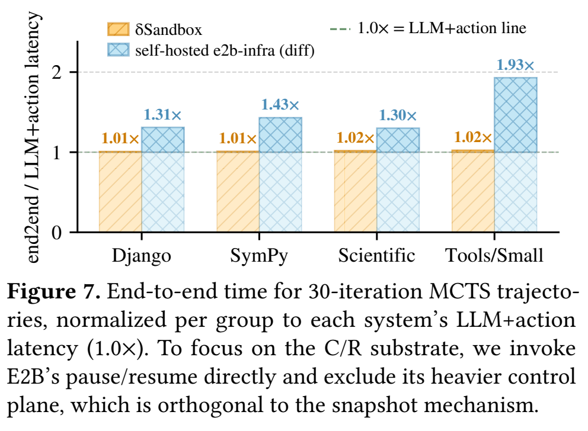</a></td>
<!-- AE-RESULT:figure-07:start -->
<td align="center" valign="top"><a href="docs/images/figure-07-ae.png">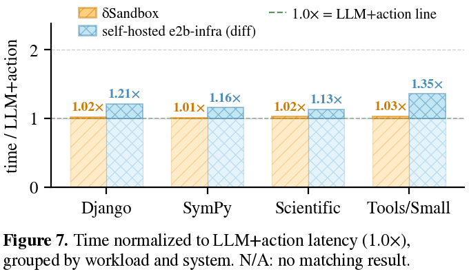</a><br><small><a href="docs/images/figure-07-comparison.png">Open full comparison</a></small></td>
<!-- AE-RESULT:figure-07:end -->
</tr>
</table>

### 2.6 Figure 8(a): CPU fan-out

<a id="figure-08"></a>
<a id="对比figure8"></a>
<a id="步骤5"></a>
<a id="figure-8-comparison"></a>
<a id="step-5"></a>

**Goal.** Compare the cost of creating usable branches from one frozen state and its scaling with branch count.

**Run.**

```bash
bash ae/run_all.sh --group figure-08-cpu --output "$AE_RUN/figure-08-cpu"
```

DeltaBox, CubeSandbox, and E2B each evaluate N=1/4/16/64. Every child must read back and validate inherited content.

**Output and interpretation.** In `figure-08-cpu-comparison.png`, compare ready time at the same N and the growth of each curve. The paper examines whether inexpensive branch creation supports wider search. Content validation is part of success: a branch is useful only if it inherits the correct state.

<table>
<tr><th>Paper figure/table</th><th>Example script output</th></tr>
<tr>
<td align="center" valign="top"><a href="ae/reference/figures/figure-08.png">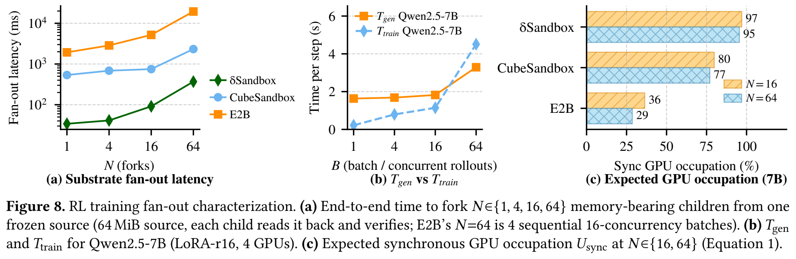</a></td>
<!-- AE-RESULT:figure-08:start -->
<td align="center" valign="top"><a href="docs/images/figure-08-cpu-ae.png">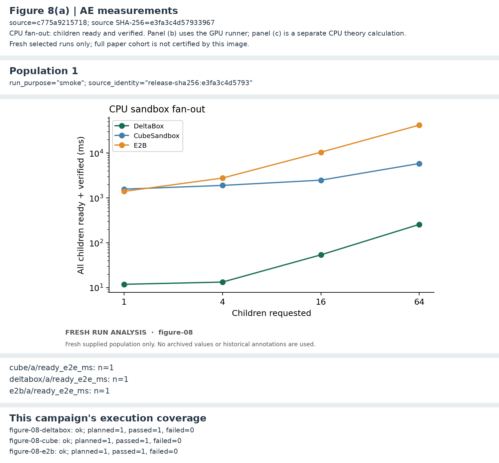</a><br><small><a href="docs/images/figure-08-cpu-comparison.png">Open full comparison</a></small></td>
<!-- AE-RESULT:figure-08:end -->
</tr>
</table>

### 2.7 Figure 8(b)(c): GPU latency and modeled occupation

<a id="figure-08-gpu"></a>
<a id="figure-8b-gpu"></a>
<a id="获得-gpu-后的命令"></a>

**Goal.** Measure generation and training time, then combine them with sandbox time to calculate the paper's synchronous GPU occupation and policy staleness.

The one-click workflow and `--group figure-08` automatically run panel (b) over SSH using [remote configuration](ae/configs/figure08-remote.json). See the [automatic workflow and dependencies](ae/paper/figure-08/README.md) for setup, admission criteria and partial-result behavior. Quick-check and analysis-only runs do not start GPU work. To select only the remote GPU stage, use the command below.


```bash
bash ae/run_all.sh --group gpu --output "$AE_RUN/figure-08-gpu"
```

To rerun every panel of Figure 8:

```bash
bash ae/run_all.sh --group figure-08 --output "$AE_RUN/figure-08"
```

The authors configure the remote model and Python environments. Admission probes GPUs 0–7 and records busy or unavailable resources as skipped; smaller available card sets produce explicitly partial results without reducing per-case parameters. See the [environment guide](ae/docs/self-hosting.md#gpu-setup).

**Output and interpretation.** Panel (b) produces per-repeat generation/training timings and `gpu/attempt-NNN/plots/figure-08b.png`; compare corresponding stages at the same batch size. After CPU fan-out and GPU measurements both succeed, panel (c) produces `gpu/attempt-NNN/comparison/theory/occupation.json` and plots. Check whether reducing sandbox time increases modeled useful occupation and reduces staleness; (c) is a theoretical calculation. Both panels are included in this run's English and Chinese comparison pages.

<table>
<tr><th>Paper figure/table</th><th>Example script output</th></tr>
<tr>
<td align="center" valign="top"><a href="ae/reference/figures/figure-08.png"></a></td>
<!-- AE-RESULT:figure-08-gpu:start -->
<td align="center" valign="top"><a href="docs/images/figure-08b.png">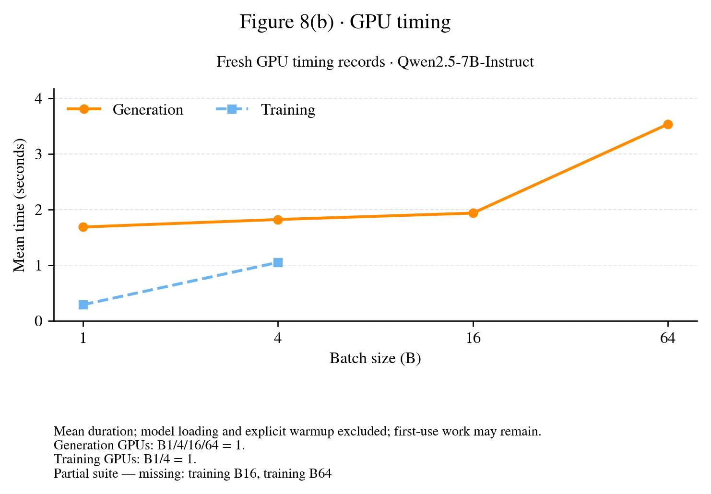</a><br><small><a href="docs/images/figure-08b-comparison.png">Open full comparison</a></small></td>
<!-- AE-RESULT:figure-08-gpu:end -->
</tr>
</table>

### 2.8 Figure 9: write amplification

<a id="figure-09"></a>
<a id="对比figure9"></a>
<a id="步骤6"></a>
<a id="figure-9-comparison"></a>
<a id="step-6"></a>

**Goal.** Compare copy-up data and device writes when editing files on ext4, XFS, and XFS+reflink, evaluating whether shared data blocks reduce write amplification.

**Run.**

```bash
bash ae/run_all.sh --group figure-09 --output "$AE_RUN/figure-09"
```

A dedicated RAM-backed entry point and configuration are described in the [self-hosting and targeted-run guide](ae/docs/self-hosting.md#specialized-runs).

**Output and interpretation.** In both panels of `figure-09-comparison.png`, compare the three curves within each file-size bin. Examine whether reflink reduces private copy-up data and how that reduction affects device I/O. Filesystem journals and metadata also generate writes, so these quantities need not be equal. The vertical axis is bytes/edit; device writes are measured using loop-device write counters.

<table>
<tr><th>Paper figure/table</th><th>Example script output</th></tr>
<tr>
<td align="center" valign="top"><a href="ae/reference/figures/figure-09.png">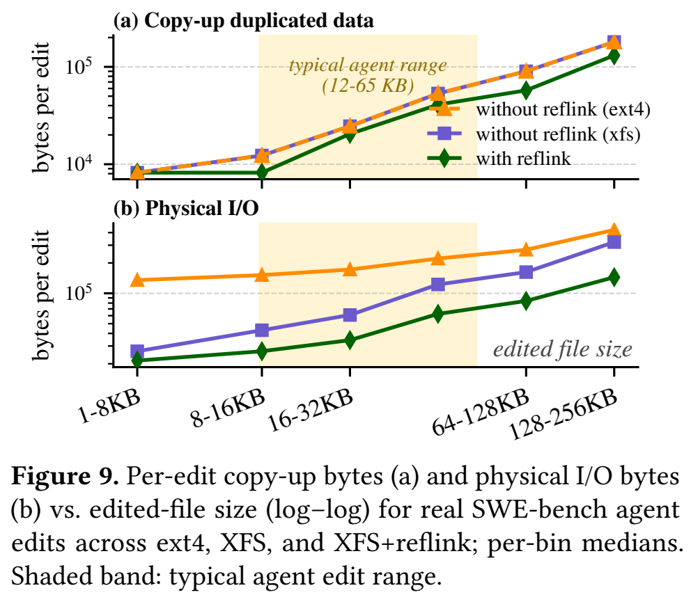</a></td>
<!-- AE-RESULT:figure-09:start -->
<td align="center" valign="top"><a href="docs/images/figure-09-ae.png">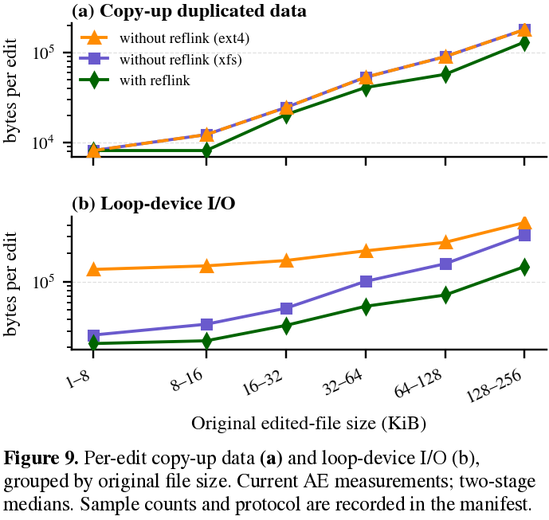</a><br><small><a href="docs/images/figure-09-comparison.png">Open full comparison</a></small></td>
<!-- AE-RESULT:figure-09:end -->
</tr>
</table>

### 2.9 Filesystem correctness (§6.3.3)

<a id="correctness"></a>
<a id="步骤7"></a>
<a id="step-7"></a>

**Goal.** Check file contents before and after checkpoint/restore, the behavior of open file descriptors referring to deleted files, and isolation of writes across checkpoints.

```bash
bash ae/run_all.sh --experiment correctness --output "$AE_RUN/correctness"
```

The entry point runs `test_full.sh`, `test_deleted_open_resurrect.sh`, and `test_cross_checkpoint_fd_cow.sh`. Open their assertion logs through `SUMMARY.md`: each script should exit 0, and restored content and file-descriptor behavior should satisfy the named assertions.

## 3. Inspect, validate, and replot results

<a id="results"></a>
<a id="实验结果"></a>

Individual experiments and the full suite use the same output structure. Paths below are relative to the printed result directory; `review.json` identifies `attempt-NNN`.

| Path | Purpose |
| --- | --- |
| `result.md`, `SUMMARY.md`, `review.json` | Check status and locate outputs or failed steps |
| `comparison/attempt-NNN/README.md`, `README-zh.md` | English and Chinese pages comparing the paper with your measurements |
| `analysis/attempt-NNN/metrics.csv`, `series.csv` | Inspect numerical summaries and plotted series |
| `gpu/attempt-NNN/` | GPU measurements, resource checks, plots, and Figure 8(c) calculations |
| `runs/`, `logs/attempt-NNN/` | Inspect per-event data and execution logs |
| `environment/attempt-NNN/` | Inspect configuration, CPU frequencies, and restoration records |

First confirm that the selected experiments succeeded, then use each section's interpretation to evaluate the paper's claims. Small checks are for validating the workflow; `N/A` / `—` is not zero.

<a id="绘图"></a>
<a id="发布图片"></a>
<a id="6-分析结果与绘图"></a>
<a id="plotting"></a>
<a id="publishing-figures"></a>

To regenerate figures from raw results, follow the [analysis guide](ae/docs/self-hosting.md#reanalyze); no new measurements are needed.

## 4. Resume and troubleshoot

<a id="troubleshooting"></a>
<a id="运行提示"></a>
<a id="6-运行提示"></a>
<a id="7-运行提示"></a>
<a id="当前边界"></a>
<a id="running-tips"></a>
<a id="current-scope"></a>

To resume, keep the original source, configuration, and experiment selection, replacing `--output` with `--resume`. For example, resume Figure 6 with:

```bash
bash ae/run_all.sh --group figure-06 --resume "$AE_RUN/figure-06"
```

| Situation | Action |
| --- | --- |
| Output directory exists | Resume the same run, or choose a new directory for a new run |
| No recent terminal output | Inspect the log linked from `SUMMARY.md`, or `logs/attempt-NNN/<step>/stdout.log` |
| GPU resources are unavailable or all busy | Contact the authors to allocate GPUs for the AE machine, then resume the same output directory |
| Dependency, permission, or template preflight fails | Save `SUMMARY.md` and relevant logs, and contact the authors through the AE submission system |
| You want a smaller check | Add `--limit 1` to an individual command and use a separate output |
| You want the experiment names | Run `bash ae/run_all.sh --list` |

Keep the supplied resource configuration during measurement. On the shared machine, avoid simultaneous performance runs on the same CPUs/NUMA node. Account details are in the [hosted-access guide](ae/docs/hosted-access.md).

## 5. Self-hosting and further reading

<a id="self-hosting"></a>
<a id="环境准备"></a>
<a id="3-详细命令行指南"></a>
<a id="a2-构建镜像"></a>
<a id="baseline-配置"></a>
<a id="guest-内核"></a>
<a id="测量环境"></a>
<a id="路径-b母盘不可获取时的实验性重建"></a>
<a id="environment-setup"></a>
<a id="baseline-configuration"></a>
<a id="measurement-conditions"></a>
<a id="detailed-cli-guide"></a>

Self-hosting requires Linux x86-64, KVM, a DeltaBox guest kernel and disks, workload environments, and the selected baseline services. See the [self-hosting guide](ae/docs/self-hosting.md) for resources, build commands, configuration, and preflight checks. The GPU environment is independent of the CPU/KVM environment.

- [Experiment inputs and file manifests](ae/paper/README.md)
- [Image builds and template preparation](ae/images/README.md)
